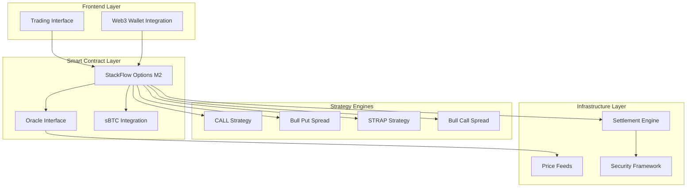

# Design Document

## Overview

The Milestone 2 design builds upon the successful Milestone 1 implementation by expanding StackFlow's options trading capabilities with two sophisticated strategies (STRAP and Bull Call Spread), implementing comprehensive oracle integration, adding sBTC collateral support, and establishing enterprise-grade security through professional auditing. This design maintains backward compatibility with existing M1 strategies while introducing advanced features that position StackFlow as a comprehensive Bitcoin-secured derivatives platform.

The architecture follows a modular approach where new strategies integrate seamlessly with the existing infrastructure, oracle systems provide reliable price feeds across all strategies, and sBTC integration enables Bitcoin holders to participate in derivatives trading without selling their Bitcoin holdings.

## Architecture

### System Architecture Overview



### Contract Architecture

The M2 contract extends the M1 foundation with:
- **Strategy Expansion**: STRAP and Bull Call Spread implementations
- **Oracle Integration**: Standardized price feed interface with consensus mechanisms
- **sBTC Support**: Bitcoin collateral management with real-time valuation
- **Enhanced Security**: Multi-signature controls and emergency pause mechanisms
- **Advanced Settlement**: Automated expiry processing with batch operations

### Data Flow Architecture

1. **Strategy Creation**: User selects strategy → Contract validates parameters → Oracle provides price reference → sBTC collateral locked → Position created
2. **Price Updates**: Oracle aggregates feeds → Validates consensus → Updates contract state → Triggers settlement checks
3. **Exercise/Settlement**: User initiates → Oracle provides current price → Contract calculates payout → sBTC collateral released → Funds transferred

## Components and Interfaces

### Core Contract Components

#### Strategy Manager
- **Purpose**: Orchestrates all four strategy types with unified interface
- **Interface**: `create-strategy(type, params) -> option-id`
- **Responsibilities**: Parameter validation, strategy routing, position tracking

#### Oracle Interface
- **Purpose**: Provides reliable price feeds with consensus mechanisms
- **Interface**: `get-price(asset) -> (price, timestamp, confidence)`
- **Responsibilities**: Price aggregation, staleness checks, consensus validation

#### sBTC Integration Module
- **Purpose**: Manages Bitcoin collateral through sBTC tokens
- **Interface**: `deposit-sbtc(amount) -> collateral-id`, `withdraw-sbtc(amount) -> success`
- **Responsibilities**: Collateral valuation, margin calculations, liquidation triggers

#### Settlement Engine
- **Purpose**: Automated option expiry and payout processing
- **Interface**: `auto-settle(option-id) -> payout`, `batch-settle(option-ids) -> results`
- **Responsibilities**: Expiry monitoring, payout calculations, fund transfers

### Strategy Interfaces

#### STRAP Strategy Interface
```clarity
(define-public (create-strap-option 
  (amount uint) 
  (strike uint) 
  (premium uint) 
  (expiry uint)) 
  -> (response uint uint))
```

#### Bull Call Spread Interface
```clarity
(define-public (create-bull-call-spread 
  (amount uint) 
  (lower-strike uint) 
  (upper-strike uint) 
  (net-premium uint) 
  (expiry uint)) 
  -> (response uint uint))
```

### Oracle Integration Interface

#### Price Feed Trait
```clarity
(define-trait price-oracle-trait
  ((get-price (string-ascii 12)) (response {price: uint, timestamp: uint, confidence: uint} uint))
  ((update-price (string-ascii 12) uint uint) (response bool uint))
  ((is-price-fresh (string-ascii 12) uint) (response bool uint)))
```

### sBTC Integration Interface

#### Collateral Management
```clarity
(define-public (deposit-sbtc-collateral (amount uint)) -> (response uint uint))
(define-public (withdraw-sbtc-collateral (amount uint)) -> (response bool uint))
(define-read-only (get-collateral-value (user principal)) -> (response uint uint))
(define-read-only (get-margin-requirements (user principal)) -> (response uint uint))
```

## Data Models

### Enhanced Option Structure
```clarity
(define-map options uint {
  owner: principal,
  strategy: (string-ascii 4),    ;; "CALL", "BPSP", "STRAP", "BCSP"
  amount-ustx: uint,
  strike-price: uint,
  upper-strike: uint,            ;; For spread strategies
  premium-paid: uint,
  collateral-type: (string-ascii 4), ;; "STX" or "sBTC"
  collateral-amount: uint,
  created-at: uint,
  expiry-block: uint,
  oracle-price-at-creation: uint,
  is-exercised: bool,
  is-settled: bool,
  settlement-price: uint
})
```

### STRAP Strategy Data
```clarity
(define-map strap-components uint {
  call-option-1: uint,           ;; First call option ID
  call-option-2: uint,           ;; Second call option ID  
  put-option: uint,              ;; Put option ID
  combined-premium: uint,
  max-profit-potential: uint
})
```

### Bull Call Spread Data
```clarity
(define-map bull-call-spreads uint {
  long-call: uint,               ;; Lower strike call (bought)
  short-call: uint,              ;; Higher strike call (sold)
  net-premium: uint,             ;; Net premium paid
  max-profit: uint,              ;; Maximum profit potential
  max-loss: uint                 ;; Maximum loss potential
})
```

### Oracle Price Data
```clarity
(define-map price-feeds (string-ascii 12) {
  current-price: uint,
  last-updated: uint,
  confidence-score: uint,        ;; 0-100 confidence level
  source-count: uint,            ;; Number of contributing sources
  price-history: (list 10 uint)  ;; Recent price history
})
```

### sBTC Collateral Data
```clarity
(define-map sbtc-collateral principal {
  total-deposited: uint,
  available-balance: uint,
  locked-in-positions: uint,
  last-valuation-price: uint,
  margin-call-threshold: uint
})
```

## Correctness Properties

*A property is a characteristic or behavior that should hold true across all valid executions of a system-essentially, a formal statement about what the system should do. Properties serve as the bridge between human-readable specifications and machine-verifiable correctness guarantees.*

Based on the prework analysis, I have identified the testable acceptance criteria and performed property reflection to eliminate redundancy. The following properties represent the core correctness guarantees for Milestone 2:

### Property 1: STRAP Strategy Component Consistency
*For any* STRAP option creation with valid parameters, the system should create exactly 2 call options and 1 put option at the same strike price
**Validates: Requirements 1.1**

### Property 2: STRAP Payout Calculation Above Strike
*For any* STRAP option when price moves significantly above the strike, the system should calculate payouts from both call options
**Validates: Requirements 1.2**

### Property 3: STRAP Payout Calculation Below Strike
*For any* STRAP option when price moves below the strike, the system should calculate payout from the put option only
**Validates: Requirements 1.3**

### Property 4: STRAP Settlement Processing
*For any* expired STRAP option, the Settlement Engine should automatically process all three component options
**Validates: Requirements 1.4**

### Property 5: STRAP Maximum Payout Bounds
*For any* STRAP option payout calculation, the total payout should never exceed the theoretical maximum profit potential
**Validates: Requirements 1.5**

### Property 6: Bull Call Spread Strike Validation
*For any* Bull Call Spread creation, the system should validate that lower strike is strictly less than upper strike
**Validates: Requirements 2.1**

### Property 7: Bull Call Spread Payout Above Upper Strike
*For any* Bull Call Spread when price is above upper strike, the system should calculate maximum profit payout
**Validates: Requirements 2.2**

### Property 8: Bull Call Spread Payout Between Strikes
*For any* Bull Call Spread when price is between strikes, the system should calculate proportional payout
**Validates: Requirements 2.3**

### Property 9: Bull Call Spread Payout Below Lower Strike
*For any* Bull Call Spread when price is below lower strike, the system should return zero payout
**Validates: Requirements 2.4**

### Property 10: Bull Call Spread Collateral Requirements
*For any* Bull Call Spread creation, the system should require collateral equal to maximum potential loss
**Validates: Requirements 2.5**

### Property 11: Oracle Price Range Validation
*For any* price update from the Oracle System, the price must fall within acceptable ranges (greater than zero and less than maximum threshold)
**Validates: Requirements 3.1**

### Property 12: Oracle Consensus Mechanism
*For any* conflicting price data from multiple sources, the Oracle System should produce a single consensus price
**Validates: Requirements 3.2**

### Property 13: Oracle Settlement Price Usage
*For any* settlement operation, the Settlement Engine should use the most recent validated price from the Oracle System
**Validates: Requirements 3.4**

### Property 14: Oracle Staleness Rejection
*For any* price data older than the acceptable threshold, the Oracle System should reject the stale data
**Validates: Requirements 3.5**

### Property 15: sBTC Token Authenticity Validation
*For any* sBTC deposit, the sBTC Integration should validate token authenticity before accepting as collateral
**Validates: Requirements 4.1**

### Property 16: sBTC Collateral Valuation Consistency
*For any* sBTC collateral calculation, the system should use real-time sBTC to USD conversion rates
**Validates: Requirements 4.2**

### Property 17: sBTC Withdrawal Margin Check
*For any* sBTC withdrawal request, the system should ensure sufficient collateral remains for open positions
**Validates: Requirements 4.3**

### Property 18: sBTC Liquidation Trigger
*For any* sBTC collateral position below maintenance margin, the system should trigger liquidation procedures
**Validates: Requirements 4.4**

### Property 19: Simulation Trade Count Validation
*For any* simulation run, the Simulation Framework should execute at least 300 trades across all four strategies
**Validates: Requirements 6.1**

### Property 20: Simulation Market Condition Coverage
*For any* simulation run, the Simulation Framework should test extreme price movements and volatility scenarios
**Validates: Requirements 6.2**

### Property 21: Simulation Risk Metrics Calculation
*For any* simulation analysis, the Simulation Framework should calculate risk metrics including Sharpe ratio and maximum drawdown
**Validates: Requirements 6.3**

### Property 22: Cross-Strategy Interaction Validation
*For any* cross-strategy testing, the Simulation Framework should validate interactions between different strategy types
**Validates: Requirements 6.4**

### Property 23: Invalid Parameter Rejection
*For any* invalid parameters provided to any strategy, the system should reject the transaction with descriptive error messages
**Validates: Requirements 7.1**

### Property 24: Strategy Execution Event Emission
*For any* strategy execution, the system should emit detailed events for monitoring and analytics
**Validates: Requirements 8.1**

### Property 25: Performance Metrics Collection
*For any* performance metrics collection, the system should track gas usage, execution time, and success rates
**Validates: Requirements 8.2**

## Error Handling

### Error Classification System

#### Critical Errors (System Halt)
- **Oracle Failure**: Complete loss of price feeds triggers emergency pause
- **sBTC Bridge Failure**: sBTC token contract becomes unresponsive
- **Contract Upgrade Failure**: Failed deployment of security fixes

#### Major Errors (Graceful Degradation)
- **Partial Oracle Outage**: Reduced confidence scores, increased margins
- **sBTC Liquidity Issues**: Temporary suspension of sBTC deposits
- **High Gas Costs**: Batch operations to reduce individual transaction costs

#### Minor Errors (User Feedback)
- **Invalid Parameters**: Clear error messages with correction guidance
- **Insufficient Funds**: Detailed breakdown of required amounts
- **Expired Options**: Automatic settlement suggestions

### Error Recovery Mechanisms

#### Oracle Recovery
1. **Fallback Sources**: Secondary price feed providers activate automatically
2. **Price Interpolation**: Historical data used for short-term price estimates
3. **Manual Override**: Emergency price setting by authorized administrators

#### sBTC Recovery
1. **Collateral Freeze**: Prevent new positions while maintaining existing ones
2. **Alternative Collateral**: Temporary acceptance of STX collateral at higher margins
3. **Gradual Migration**: Phased transition to alternative Bitcoin collateral solutions

#### Contract Recovery
1. **State Snapshots**: Regular backups of critical contract state
2. **Emergency Pause**: Immediate halt of all operations while preserving user funds
3. **Upgrade Procedures**: Seamless migration to patched contract versions

## Testing Strategy

### Dual Testing Approach

The testing strategy employs both unit testing and property-based testing to ensure comprehensive coverage and correctness validation.

#### Unit Testing Framework
- **Framework**: Vitest with Clarinet SDK integration
- **Coverage Target**: ≥95% code coverage across all contract functions
- **Test Categories**: 
  - Strategy creation and validation tests
  - Oracle integration tests  
  - sBTC collateral management tests
  - Error handling and edge case tests
  - Administrative function tests

#### Property-Based Testing Framework
- **Framework**: Clarinet's built-in property testing with custom generators
- **Minimum Iterations**: 100 test cases per property to ensure statistical significance
- **Property Test Requirements**:
  - Each correctness property must be implemented by a single property-based test
  - Tests must be tagged with format: `**Feature: milestone-2-strategy-expansion, Property {number}: {property_text}**`
  - Custom generators for realistic trading scenarios and market conditions
  - Comprehensive input space coverage including edge cases and boundary conditions

#### Integration Testing
- **End-to-End Workflows**: Complete trading lifecycle from strategy creation to settlement
- **Cross-Strategy Testing**: Interactions between different strategy types in user portfolios
- **Oracle Integration**: Real-world price feed scenarios and failure modes
- **sBTC Integration**: Bitcoin collateral lifecycle including deposits, valuations, and withdrawals

#### Simulation Testing
- **Trade Volume**: Minimum 300 simulated trades across all four strategies
- **Market Conditions**: Bull markets, bear markets, high volatility, and sideways movement
- **Stress Testing**: Extreme price movements, oracle failures, and high transaction volumes
- **Performance Analysis**: Gas costs, execution times, and scalability metrics

### Testing Configuration
- **Property-based tests configured for minimum 100 iterations per property**
- **Unit tests focus on specific examples and integration points**
- **Simulation framework validates strategy performance across diverse market conditions**
- **All tests must pass before deployment to production environment**