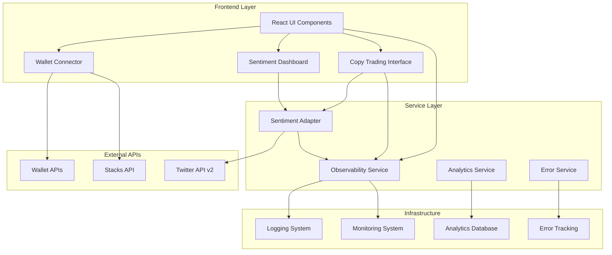

# Milestone 3: User Interface & Beta Launch Design

## Overview

This design document outlines the implementation of StackFlow's Milestone 3 deliverables, focusing on completing the user interface, integrating live Twitter API for social sentiment analysis, implementing comprehensive observability systems, and launching a beta testing program. The design leverages existing frontend components while adding critical missing infrastructure for production readiness.

## Architecture

### High-Level Architecture



### Component Integration

The design integrates with existing components:
- **Existing**: `SocialSentimentDashboard`, `CopyTradingPools`, `WhaleTracker`, `MemeSignals`
- **Enhanced**: Wallet integration, error handling, performance monitoring
- **New**: Twitter API integration, observability infrastructure, beta feedback system

## Components and Interfaces

### Twitter API Integration Service

**Purpose**: Real-time social sentiment analysis using Twitter API v2
**Location**: `src/services/twitterSentimentService.ts`

```typescript
interface TwitterSentimentService {
  // Core sentiment analysis
  fetchTweets(query: string, options?: TwitterQueryOptions): Promise<Tweet[]>
  analyzeSentiment(tweets: Tweet[]): Promise<SentimentAnalysis>
  getViralContent(timeframe: string): Promise<ViralContent[]>
  
  // Real-time streaming
  startSentimentStream(keywords: string[]): Promise<void>
  stopSentimentStream(): void
  
  // Caching and rate limiting
  getCachedSentiment(asset: string): SentimentData | null
  handleRateLimit(): Promise<void>
}

interface SentimentAnalysis {
  score: number; // -100 to 100
  confidence: number; // 0 to 100
  volume: number;
  trending: boolean;
  keywords: string[];
  timeframe: string;
}
```

### Observability System

**Purpose**: Comprehensive logging, monitoring, and error tracking
**Location**: `src/services/observabilityService.ts`

```typescript
interface ObservabilityService {
  // Logging
  logEvent(event: LogEvent): void
  logError(error: Error, context?: any): void
  logPerformance(metric: PerformanceMetric): void
  
  // Monitoring
  trackUserAction(action: UserAction): void
  trackSystemMetric(metric: SystemMetric): void
  getHealthStatus(): HealthStatus
  
  // Error tracking
  captureException(error: Error, tags?: Record<string, string>): void
  setUserContext(user: UserContext): void
  addBreadcrumb(breadcrumb: Breadcrumb): void
}

interface LogEvent {
  level: 'debug' | 'info' | 'warn' | 'error'
  message: string
  timestamp: number
  userId?: string
  sessionId: string
  component: string
  metadata?: Record<string, any>
}
```

### Enhanced Wallet Integration

**Purpose**: Robust wallet connectivity with error handling and monitoring
**Location**: `src/services/enhancedWalletService.ts`

```typescript
interface EnhancedWalletService {
  // Connection management
  connectWallet(provider: 'leather' | 'xverse'): Promise<WalletConnection>
  disconnectWallet(): Promise<void>
  switchWallet(provider: string): Promise<WalletConnection>
  
  // Balance and transaction monitoring
  getBalances(): Promise<WalletBalances>
  monitorTransaction(txId: string): Promise<TransactionResult>
  estimateGas(transaction: Transaction): Promise<GasEstimate>
  
  // Error handling and recovery
  handleConnectionError(error: WalletError): Promise<void>
  retryFailedTransaction(txId: string): Promise<TransactionResult>
  validateWalletState(): Promise<boolean>
}
```

### Beta Feedback System

**Purpose**: In-app feedback collection and issue tracking
**Location**: `src/services/betaFeedbackService.ts`

```typescript
interface BetaFeedbackService {
  // Feedback collection
  submitFeedback(feedback: BetaFeedback): Promise<string>
  reportIssue(issue: IssueReport): Promise<string>
  trackUsage(usage: UsageMetric): void
  
  // Analytics and reporting
  getUserAnalytics(userId: string): Promise<UserAnalytics>
  generateUsageReport(timeframe: string): Promise<UsageReport>
  getSystemHealth(): Promise<SystemHealth>
}

interface BetaFeedback {
  userId: string
  category: 'bug' | 'feature' | 'improvement' | 'general'
  severity: 'low' | 'medium' | 'high' | 'critical'
  description: string
  steps?: string[]
  expectedBehavior?: string
  actualBehavior?: string
  browserInfo: BrowserInfo
  systemState: SystemState
}
```

## Data Models

### Twitter Integration Models

```typescript
interface Tweet {
  id: string
  text: string
  author: TwitterUser
  createdAt: Date
  metrics: TweetMetrics
  entities?: TweetEntities
}

interface TwitterUser {
  id: string
  username: string
  displayName: string
  verified: boolean
  followersCount: number
}

interface TweetMetrics {
  retweetCount: number
  likeCount: number
  replyCount: number
  quoteCount: number
}

interface SentimentData {
  asset: string
  score: number
  confidence: number
  volume: number
  trending: boolean
  lastUpdated: Date
  sources: SentimentSource[]
}
```

### Observability Models

```typescript
interface SystemMetric {
  name: string
  value: number
  unit: string
  timestamp: Date
  tags: Record<string, string>
}

interface UserAction {
  userId: string
  action: string
  component: string
  timestamp: Date
  metadata?: Record<string, any>
}

interface HealthStatus {
  status: 'healthy' | 'degraded' | 'unhealthy'
  services: ServiceHealth[]
  uptime: number
  lastCheck: Date
}

interface ServiceHealth {
  name: string
  status: 'up' | 'down' | 'degraded'
  responseTime?: number
  errorRate?: number
  lastCheck: Date
}
```

### Enhanced Wallet Models

```typescript
interface WalletConnection {
  provider: 'leather' | 'xverse'
  address: string
  stxAddress: string
  btcAddress?: string
  connected: boolean
  capabilities: WalletCapability[]
}

interface WalletBalances {
  stx: TokenBalance
  btc?: TokenBalance
  tokens: TokenBalance[]
}

interface TokenBalance {
  symbol: string
  balance: number
  usdValue?: number
  lastUpdated: Date
}
```

## Correctness Properties

*A property is a characteristic or behavior that should hold true across all valid executions of a system-essentially, a formal statement about what the system should do. Properties serve as the bridge between human-readable specifications and machine-verifiable correctness guarantees.*

### Property 1: Multi-Wallet Support Consistency
*For any* wallet provider (Leather or Xverse), the connection process should succeed and provide consistent functionality
**Validates: Requirements 1.1**

### Property 2: Wallet Balance Display Accuracy
*For any* connected wallet, the displayed STX and BTC balances should match the actual wallet balances
**Validates: Requirements 1.2**

### Property 3: Wallet Disconnection State Cleanup
*For any* wallet disconnection, all session data should be cleared and the system should return to disconnected state
**Validates: Requirements 1.3**

### Property 4: Copy Trading Dashboard Data Completeness
*For any* whale displayed in the copy trading dashboard, all required metrics (performance, win rate, recent trades) should be present
**Validates: Requirements 2.1**

### Property 5: Copy Trading Investment Transaction Execution
*For any* copy trading pool join operation, the investment transaction should be executed and confirmed successfully
**Validates: Requirements 2.3**

### Property 6: Twitter API Integration Functionality
*For any* Twitter API query for crypto-related content, relevant tweets should be fetched successfully
**Validates: Requirements 3.1**

### Property 7: Sentiment Analysis Calculation Consistency
*For any* set of tweets processed, sentiment scores should be calculated consistently using the NLP algorithm
**Validates: Requirements 3.2**

### Property 8: Twitter API Rate Limit Compliance
*For any* sequence of Twitter API calls, the system should never exceed rate limits and should gracefully handle throttling
**Validates: Requirements 3.5**

### Property 9: User Action Logging Completeness
*For any* user action performed, detailed events with timestamps and user context should be logged
**Validates: Requirements 4.1**

### Property 10: Performance Metrics Tracking
*For any* system operation, response times, error rates, and resource usage should be tracked accurately
**Validates: Requirements 4.2**

### Property 11: Error Capture and Notification
*For any* error that occurs, stack traces should be captured and administrators should be notified appropriately
**Validates: Requirements 4.3**

### Property 12: Beta Feedback Collection Functionality
*For any* user-reported issue, the feedback system should capture the issue with proper categorization
**Validates: Requirements 5.3**

### Property 13: Feedback Ticket Creation with Context
*For any* submitted feedback, tickets should be created automatically with user context and system state
**Validates: Requirements 5.4**

### Property 14: API Failure Retry Logic
*For any* failed API call, exponential backoff retry logic should be implemented with maximum attempt limits
**Validates: Requirements 6.1**

### Property 15: Offline Mode Functionality
*For any* network connectivity loss, offline indicators should be displayed and actions should be queued for retry
**Validates: Requirements 6.2**

### Property 16: Graceful Service Degradation
*For any* external service unavailability, the system should gracefully degrade functionality using cached data
**Validates: Requirements 6.4**

### Property 17: HTTPS Communication Security
*For any* data transmission, HTTPS encryption should be used for all communications
**Validates: Requirements 7.1**

### Property 18: Security Event Audit Logging
*For any* security-relevant activity, appropriate audit logs should be created for compliance purposes
**Validates: Requirements 7.5**

### Property 19: User Interaction Analytics Tracking
*For any* user feature interaction, usage patterns and adoption rates should be tracked accurately
**Validates: Requirements 8.1**

### Property 20: Trading Performance Analytics
*For any* trading activity, strategy performance and user success metrics should be recorded correctly
**Validates: Requirements 8.2**

## Error Handling

### Twitter API Error Handling

1. **Rate Limiting**: Implement exponential backoff with jitter
2. **Network Failures**: Retry with circuit breaker pattern
3. **Authentication Errors**: Automatic token refresh with fallback
4. **Data Parsing Errors**: Graceful degradation with cached data

### Wallet Integration Error Handling

1. **Connection Failures**: Clear error messages with retry options
2. **Transaction Failures**: Detailed error analysis and suggested fixes
3. **Network Issues**: Offline mode with queued operations
4. **Provider Switching**: Seamless transition handling

### System-Wide Error Handling

1. **Unhandled Exceptions**: Global error boundary with user-friendly messages
2. **API Failures**: Graceful degradation with cached data
3. **Performance Issues**: Automatic performance monitoring and alerts
4. **Data Corruption**: Validation and recovery mechanisms

## Testing Strategy

### Unit Testing Approach

- **Twitter Service**: Mock API responses, test sentiment calculation algorithms
- **Wallet Service**: Mock wallet providers, test connection state management
- **Observability**: Test event capture, metric calculation, and alert triggering
- **Error Handling**: Test all error scenarios and recovery mechanisms

### Property-Based Testing Requirements

The system will use **fast-check** for JavaScript/TypeScript property-based testing. Each property-based test will run a minimum of 100 iterations to ensure comprehensive coverage.

**Property Test Implementation Requirements:**
- Each correctness property must be implemented as a single property-based test
- Tests must be tagged with comments referencing the design document property
- Tag format: `**Feature: milestone-3-ui-beta-launch, Property {number}: {property_text}**`
- Tests should generate realistic data that covers edge cases and boundary conditions

### Integration Testing

- **End-to-End Wallet Flow**: Connect → Trade → Monitor → Disconnect
- **Twitter Integration**: API calls → Sentiment analysis → Dashboard updates
- **Copy Trading Flow**: Select whale → Join pool → Monitor performance
- **Error Recovery**: Simulate failures → Verify recovery → Validate state

### Beta Testing Strategy

1. **Closed Beta**: 75+ invited users with diverse trading experience
2. **Feedback Collection**: In-app feedback forms with automatic context capture
3. **Performance Monitoring**: Real-time metrics during beta period
4. **Issue Triage**: Automated categorization and priority assignment
5. **Success Metrics**: 80%+ uptime, user satisfaction scores, feature adoption rates

## Implementation Notes

### Twitter API Integration

- Use Twitter API v2 with Bearer Token authentication
- Implement streaming for real-time sentiment updates
- Cache sentiment data to reduce API calls
- Use webhooks for high-volume sentiment tracking

### Observability Infrastructure

- Implement structured logging with JSON format
- Use performance observers for client-side metrics
- Integrate with error tracking service (e.g., Sentry)
- Create real-time dashboards for system health

### Security Considerations

- Encrypt sensitive data at rest and in transit
- Implement secure API key management
- Use HTTPS for all communications
- Regular security audits and penetration testing

### Performance Optimization

- Implement lazy loading for heavy components
- Use service workers for offline functionality
- Optimize bundle size with code splitting
- Cache frequently accessed data with appropriate TTL